# Mail

Usually, a mail server consists of three parts: MTA, MUA, and MDA.

- MUA(Mail User Agent): This script doesn't intall MUA by default, but we recommend [rainloop](https://www.rainloop.net/) or [Roundcube](https://roundcube.net/).
- MTA(Mail Transfer Agent): This script choose postfix as MTA.
- MDA(Mail Delivery Agent): This script choose dovecot as MDA.

## How to install

```shell []
cd scripts
./mail.sh
```

if u just want to install specific package:

```shell []
cd scripts
./postfix.sh      # just install postfix
./opendkim.sh     # just install opendkim
./opendmarc.sh    # just install opendmarc
./dovecot.sh      # just install dovecot
```

## Mail Introduction

```mermaid
flowchart LR
    subgraph Sender_Side["📤 发送方环境"]
        MUA_Send["🖥️ 发送方 MUA\n(Outlook/Thunderbird/Webmail)"] 
        SUB_Send["🔐 提交阶段"]
        MTA_Send["📦 发送方 MTA\n(Postfix/Exim)"]
    end

    subgraph Network["🌐 互联网传输"]
        DNS_MX["🔍 DNS MX 查询"]
        TLS_Nego["🔐 TLS 加密握手"]
        SMTP_Relay["🔄 SMTP 中继传输"]
    end

    subgraph Receiver_Side["📥 接收方环境"]
        MTA_Recv["📦 接收方 MTA\n(Postfix/Exim)"]
        FILTER["🛡️ 安全过滤\n(SPF/DKIM/DMARC/RBL)"]
        MDA["📬 MDA\n(Dovecot LDA/Procmail)"]
        MailStore["💾 邮箱存储\n(Maildir/mbox)"]
        MUA_Recv["🖥️ 接收方 MUA\n(IMAP/POP3 拉取)"]
        Quarantine["🚫 垃圾邮件/拒收"]
    end

    %% 发送流程
    MUA_Send -->|"SMTP Submission\n(端口 587/465 + STARTTLS)"| SUB_Send
    SUB_Send -->|SASL 认证 + 邮件入队| MTA_Send
    
    %% 路由决策
    MTA_Send -->|查询收件人域名 MX 记录| DNS_MX
    DNS_MX -->|返回 mx.receiver.com| MTA_Send
    
    %% 网络传输
    MTA_Send -->|"SMTP over TLS\n(端口 25 + DANE/MTA-STS)"| TLS_Nego
    TLS_Nego -->|加密通道建立| SMTP_Relay
    SMTP_Relay -->|DATA 传输邮件内容| MTA_Recv
    
    %% 接收处理
    MTA_Recv -->|策略检查| FILTER
    FILTER -->|"✅ 验证通过"| MDA
    FILTER -->|"❌ 拒绝/隔离"| Quarantine
    
    %% 本地投递
    MDA -->|"Sieve 规则过滤\n(自动分类/转发)"| MailStore
    MDA -->|以用户身份写入文件| MailStore
    
    %% 用户读取
    MailStore -->|IMAP/POP3 + SSL| MUA_Recv

    %% 样式定义
    classDef security fill:#e8f4f8,stroke:#2a9df4,stroke-width:2px
    class SUB_Send,TLS_Nego,FILTER,MailStore security
```



# Related: 

- [Postfix Configuration Parameters](https://www.postfix.org/postconf.5.html)
- [opendkim](https://www.opendkim.org/opendkim.conf.5.html)
- [OPENDMARC REPORTS](http://www.trusteddomain.org/opendmarc/reports-README)
- [Set up DMARC (verification) for Postfix on Debian server](https://www.mybluelinux.com/set-up-dmarc-verification-for-postfix-on-debian-server/)